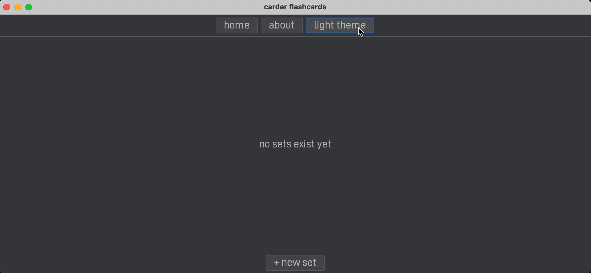

# Carder Flashcards:
### A simple desktop application for creating and studying flashcards.

---


## 📚 Table of Contents
1. [Project Summary](#-project-summary)
2. [Features](#-features)
3. [Installation Instructions](#-installation-instructions)
4. [Usage Guide](#-usage-guide)
5. [License](#-license)
6. [Feedback](#-feedback)
7. [Contributions](#-contributions)

---

## 📖 Project Summary
Carder Flashcards is a simple desktop studying app that allows users to create, study, edit, and delete flashcard sets locally. Users can study their flashcards in various ways to improve memory retention, including:
- **Non-tracking mode**: Sequentially move through flashcard sets
- **Tracking mode**: Sort cards into "unknown" and "known" categories and studies unknown terms
- **Shuffle mode**: Randomly orders the flashcards for varied studying.

I developed this project to address the issues and bugs I encountered using [Quizlet](https://quizlet.com). The application is entirely built in Java using [Swing](https://en.wikipedia.org/wiki/Swing_(Java)) for its UI and [Maven][maven] as a build tool. All necessary [dependencies][gh-dependencies] are included in the `pom.xml` file.

---

## 📸 Features
### Flashcards: easily create as many flashcard sets as you want


### Multiple Study Modes: proven ways to study better
- Non-tracking mode for a straightforward sequential review
- Tracking mode for categorizing cards as "known" or "unknown"
- Shuffle mode for a randomized review experience


### Flexible Editing: modify and delete flashcards as needed


### Theme Toggling: easily switch between light and dark mode



### Text-to-Speech: enhances learning with audio support


---

## 🧑‍💻 Installation Instructions
### Prerequisites
Ensure that the following are installed on your system:
- **[Java 22+]**: [JDK download](https://www.oracle.com/java/technologies/javase/jdk22-archive-downloads.html)
- **[Maven 3+]**: [Maven download][maven]

### Steps for Installation
1. After [forking][fork] this repository, [clone][clone] your copy onto your local machine with:
    ```bash
   git clone https://github.com/YOUR_USERNAME/FORKED_REPO_NAME.git
   cd FORKED_REPO_NAME
   ```
2. Build the project using [Maven][maven]:
   ```bash
   mvn clean install
   ```
3. Run `src/main/java/app/App.java`
    - Ex: From [IntelliJ](https://www.jetbrains.com/idea/), navigate to `src/main/java/app/App.java` and run the `main` method.


### Common Installation Issues
- **Issue**: `java.lang.UnsupportedClassVersionError`
    - **Solution**: Ensure you have the correct JDK version installed. The project is compatible with JDK 22.

- **Issue**: Missing Maven dependencies
    - **Solution**: Run `mvn clean install` to download all required [dependencies][gh-dependencies] as specified in the `pom.xml` file.

---

## 📝 Usage Guide

### Creating Sets:
1. From the home screen, click the `+ new set` button located at the bottom. You will be moved to the creation screen
2. Fill in the title, description, as well as card fields
3. To add a card, press `+ card`
4. To delete a specific card, press the `x` button to the right of it
5. Any invalid inputs (i.e., empty) will cause an error message to display, outlining why creation has failed
6. Once all inputs all valid (i.e., non-empty), you can press either `create` or `create + study` to create the set. Pressing `create` will bring you back to the home screen, while `create + study` lets you study your newly created set

### Studying Sets:
1. From the home screen, press the `study` button for a specific set or, while in the creation screen, press `create + study` to study (both shown below). You will then be moved to the studying screen.

<p align="center">
    
</p>
<p align="center">OR</p>

<p align="center">
    
</p>

2. In the non-tracking (default) study mode, use the `prev` and `next` buttons to move through the set. When the end of your set is reached, you will be asked to go back or fully restart.

<p align="center">
    
</p>

3. In the tracking study mode, use the `unknown` and `known` buttons to sort your cards. When the end of your set is reached, you will be asked to go back, study your unknown cards, or fully restart.

<p align="center">
    
</p>

### Editing Sets:
1. To edit a set, press the `edit` button to the left of it. This will bring you to the edit screen

<p align="center">
    
</p>

2. In the edit screen, you can freely edit the title, description, and cards. The same logic for adding and removing cards applies
3. If any edits are invalid (i.e., empty) and you press `done`, an error message will display, outlining what must be corrected

<p align="center">
    
</p>

4. Once all edits are valid, you can press `done` to overwrite your previous set. You will then be brought to the home screen, where your edits will be readily apparent

**NOTE**: If you leave to the home screen or exit the app before publishing edits, they will not be saved.

### Deleting Sets:
1. To delete a set, simply press the `delete` button on the home screen. You will be prompted to confirm this deletion. Deletions are irreversible

<p align="center">
    
</p>

---

## 📄 License
This project is licensed under the MIT License. See the [LICENSE](./LICENSE) file for more information.

---

## 🤝 Contributions
This project is currently not open to contributions. However, you are welcome to [fork][fork] it.


[fork]: https://docs.github.com/en/pull-requests/collaborating-with-pull-requests/working-with-forks/fork-a-repo
[clone]: https://docs.github.com/en/repositories/creating-and-managing-repositories/cloning-a-repository
[gh-dependencies]: https://github.com/justmaso/carder-flashcards/network/dependencies
[maven]: https://maven.apache.org/download.cgi